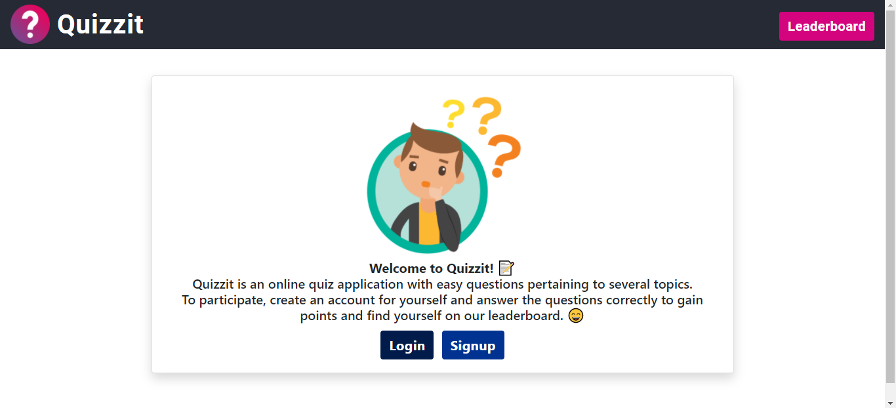

# Quizzit 📝
#### Quizzit is an online quiz application with easy questions pertaining to several topics. To participate, create an account for yourself and answer the questions correctly to gain points and find yourself on our leaderboard. 😄
> **You can view the demo [here](http://quizzitdiyajaiswal11.pythonanywhere.com/).**




## Tech Stack 👨‍💻
- **Frontend:** HTML/CSS/Bootstrap
- **Backend:** Django


## Quick Start 💫

- Fork and Clone the repository using-
```
git clone https://github.com/diyajaiswal11/Quizzit.git
```
- Create virtual environment-
```
python -m venv env
env\Scripts\activate
```
- Install dependencies using-
```
pip install -r requirements.txt
```
- Make migrations using-
```
python manage.py makemigrations
```
- Migrate Database-
```
python manage.py migrate
```
- Create a superuser-
```
python manage.py createsuperuser
```
- Run server using-
```
python manage.py runserver
```

## License 📖 
This project follows the [MIT License](https://choosealicense.com/licenses/mit/).

<h2 align="center">If you liked the project don't forget to star 🌟 and fork 🍽 the project. </h2>
<h2 align="center">Made with ❤ by Diya Jaiswal</h2>

[](https://forthebadge.com)
[](https://forthebadge.com)
[](https://forthebadge.com)
[](https://forthebadge.com)


